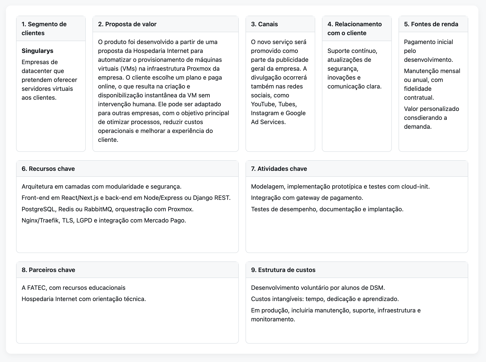
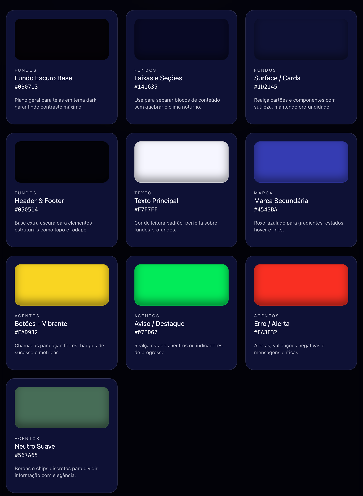
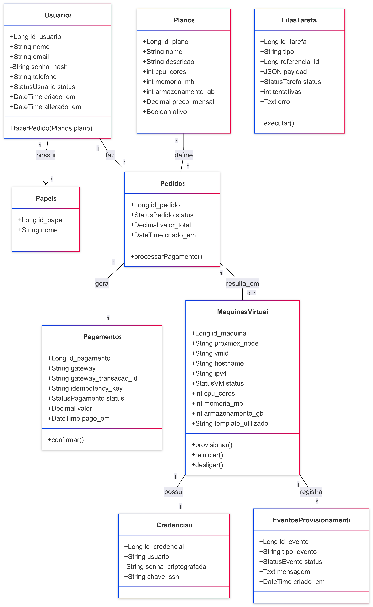

# Documentação do PI
Última atualização: 12/05/2026

# FATEC JAHU

**Faculdade de Tecnologia de Jahu**

**Curso:** Desenvolvimento de Software Multiplataforma  
**Disciplina:** Engenharia de Software II 
**Turma:** 2025.2

## Projeto

**Portal de Deploy de Máquinas Virtuais** 
**Versão 1.2 – 2025.2** 
**Última atualização: 12/05/2026 - Inclusão do Diagrama de Classes**

### Integrantes

- Evellyn Santana Marinho
- José Augusto Zen Ferri
- Rafael Henrique Biliasi
- Tainara Santos

 

## Sumário

- [Resumo](#resumo)
- [1. Introdução](#1-introdução)
  - [1.1 Problema de Pesquisa](#11-problema-de-pesquisa)
  - [1.2 Objetivos](#12-objetivos)
    - [1.2.1 Objetivo Geral](#121-objetivo-geral)
    - [1.2.2 Objetivos Específicos](#122-objetivos-específicos)
  - [1.3 Justificativa](#13-justificativa)
- [2. Referencial Teórico](#2-referencial-teórico)
- [3. Metodologia](#3-metodologia)
- [4. Requisitos Funcionais e Não Funcionais](#4-requisitos-funcionais-e-não-funcionais)
  - [4.1 Requisitos Funcionais](#41-requisitos-funcionais)
    - [RF01](#rf01) • [RF02](#rf02) • [RF03](#rf03) • [RF04](#rf04) • [RF05](#rf05)
    - [RF06](#rf06) • [RF07](#rf07) • [RF08](#rf08) 
  - [4.2 Requisitos Não Funcionais](#42-requisitos-não-funcionais)
    - [RNF01](#rnf01) • [RNF02](#rnf02) • [RNF03](#rnf03) • [RNF04](#rnf04) • [RNF05](#rnf05)
    - [RNF06](#rnf06) • [RNF07](#rnf07) • [RNF08](#rnf08) • [RNF09](#rnf09)
- [5. Estudo de Viabilidade](#5-estudo-de-viabilidade)
- [6. Canvas de Modelo de Negócio](#6-canvas-de-modelo-de-negócio)
- [7. Paleta de Cores](#7-paleta-de-cores)
- [8. Protótipo de Fluxo de Provisionamento](#8-protótipo-de-fluxo-de-provisionamento)
- [9. Protótipo de Arquitetura Técnica](#9-protótipo-de-arquitetura-técnica)
  - [9.1 Modelo de Dados (DER)](#91-modelo-de-dados-der)
  - [9.2 Diagrama de Classes](#92-diagrama-de-classes)
- [10. Segurança e Governança](#10-segurança-e-governança)
- [11. Cronograma da Primeira Etapa](#11-cronograma-da-primeira-etapa-20252)
- [12. Referências](#12-referências)

## Resumo

O presente projeto tem como finalidade o desenvolvimento de um portal web destinado ao provisionamento automático de máquinas virtuais (VMs) em ambiente Proxmox. A contratação manual gera atrasos e limita a escalabilidade. A pesquisa propõe modelar e validar um sistema que permita ao cliente selecionar planos, realizar pagamentos online e inicializar automaticamente sua instância virtual.

## 1. Introdução

O presente projeto de pesquisa está inserido no contexto da evolução dos serviços de hospedagem e virtualização, que têm como tendência a automação e a oferta de soluções self-service. A Hospedaria Internet já dispõe de sistema para cadastro e liberação de espaço em ambiente pré-configurado, com compartilhamento de recursos do servidor. Todavia, quando um cliente solicita um servidor virtual próprio, o processo ainda depende de contato direto com a empresa, que realiza manualmente a configuração e disponibilização do serviço. Esse cenário cria uma lacuna de eficiência e limita a escalabilidade do negócio.

### 1.1 Problema de Pesquisa

A problemática que se busca enfrentar consiste em suprir a ausência de um mecanismo automatizado que permita ao cliente criar e gerenciar sua própria instância de servidor virtual, sem a necessidade de intervenção humana. Pretende-se, com este projeto, eliminar essa limitação, permitindo que o usuário final escolha entre diferentes planos, efetue o pagamento diretamente no portal e inicialize sua máquina virtual de maneira imediata, segura e autônoma.

### 1.2 Objetivos

#### 1.2.1 Objetivo Geral

Desenvolver um portal para provisionamento automático de máquinas virtuais em ambiente Proxmox, integrado a sistema de pagamento online.

#### 1.2.2 Objetivos Específicos

- Implementar cadastro e autenticação de clientes;
- Disponibilizar catálogo de planos VPS;
- Integrar com gateway de pagamento;
- Automatizar clonagem de templates no Proxmox com _cloud-init_;
- Gerar credenciais no painel do cliente;
- Garantir logs de auditoria e políticas de ciclo de vida.

### 1.3 Justificativa

A proposta justifica-se pela necessidade de modernização do processo de provisionamento da Hospedaria Internet. A automação permitirá maior agilidade, redução de custos operacionais e aumento da satisfação do cliente. Além disso, alinha-se às práticas do mercado de computação em nuvem, fortalecendo a competitividade da empresa e criando diferenciais estratégicos frente à concorrência.

## 2. Referencial Teórico

A pesquisa fundamenta-se em conceitos de computação em nuvem, infraestrutura como serviço (IaaS) e automação de infraestrutura por meio de APIs e ferramentas como Proxmox e cloud-init. O National Institute of Standards and Technology (NIST) define computação em nuvem como “(...) um modelo que possibilita o acesso ubíquo, conveniente e sob demanda, por meio da rede, a um conjunto compartilhado de recursos computacionais configuráveis (por exemplo, redes, servidores, armazenamento, aplicações e serviços), que podem ser rapidamente provisionados e liberados com o mínimo de esforço de gerenciamento ou interação com o provedor de serviços (...).” (NIST, 2011).

Segundo Rios (2019, p. 16-17), citando o trabalho de Turban et al. (2018), expõe que, <i>no campo do comércio eletrônico, a integração entre sistemas de pagamento e plataformas digitais é apontada como fundamental para garantir experiências fluidas de consumo. Esses referenciais fornecem base teórica para a modelagem e a implementação do portal proposto.</i>

## 3. Metodologia

A pesquisa seguirá abordagem aplicada, com caráter exploratório e descritivo. A metodologia compreende as etapas: 1) entrevista e levantamento de requisitos funcionais e não funcionais; 2) modelagem conceitual e lógica do sistema; 3) implementação prototípica em ambiente controlado; 4) integração com gateway de pagamento; 5) testes de provisionamento em Proxmox com uso de templates cloud-init; 6) análise de desempenho e confiabilidade; 7) documentação e validação junto.

## 4. Requisitos Funcionais e Não Funcionais

### 4.1 Requisitos Funcionais

- **RF01** – Cadastrar e autenticar clientes: O sistema deve permitir o registro de novos clientes, com persistência em banco de dados (tabela `usuarios`), incluindo validação de e-mail, armazenamento seguro de senha (hash) e controle de acesso por papéis (`papeis` e `usuarios_papeis`).

- **RF02** – Catalogar planos de VPS: O portal deve exibir a lista de planos disponíveis, armazenados na tabela `planos`, contendo especificações de CPU, memória, armazenamento e preço.

- **RF03** – Selecionar e realizar pedido: O cliente deve poder selecionar um plano, gerar um pedido e visualizar os detalhes antes de confirmar, com registro na tabela `pedidos`.

- **RF04** – Integrar com gateway de pagamento: O sistema deve permitir que o cliente realize pagamento online (cartão/Pix), registrando as transações na tabela `pagamentos`, com confirmação automática via webhook e controle de idempotência.

- **RF05** – Provisionar automaticamente a VM: Após confirmação de pagamento, o sistema deve disparar o processo de criação da VM no Proxmox, a partir de um template configurado com cloud-init, utilizando processamento assíncrono via `fila_tarefas`.

- **RF06** – Configurar a VM: O sistema deve aplicar automaticamente CPU, memória, armazenamento, rede e hostname conforme o plano contratado, com persistência dessas informações na tabela `maquinas_virtuais`.

- **RF07** – Gerar e entregar as credenciais: O sistema deve registrar e disponibilizar ao cliente as credenciais de acesso à sua VM no painel do portal, armazenadas de forma segura na tabela `credenciais`.

- **RF08** – Registrar eventos de provisionamento: O sistema deve registrar todas as etapas do processo de provisionamento na tabela `eventos_provisionamento`, incluindo status, tipo e mensagens de erro ou sucesso.

---

### 4.2 Requisitos Não Funcionais

- **RNF01** – Disponibilidade SLA: O portal deve estar disponível em 99,5% do tempo mensal, excetuando-se manutenções programadas.

- **RNF02** – Desempenho: O sistema deve apresentar tempo de resposta inferior a 3 segundos para operações comuns.

- **RNF03** – Escalabilidade: O sistema deve suportar crescimento do número de clientes e provisionamento simultâneo de múltiplas VMs, sem degradação significativa de performance.

- **RNF04** – Segurança: Todas as comunicações devem ser realizadas via HTTPS (TLS 1.2 ou superior), com armazenamento seguro de credenciais e controle de acesso.

- **RNF05** – Confiabilidade: O provisionamento de VMs deve ser idempotente, garantindo que um mesmo pedido não gere múltiplas máquinas em caso de repetição de eventos do gateway.

- **RNF06** – Usabilidade: A interface deve ser intuitiva, responsiva e compatível com navegadores modernos e dispositivos móveis.

- **RNF07** – Conformidade com a LGPD: O sistema deve garantir conformidade com a Lei Geral de Proteção de Dados (LGPD), assegurando o tratamento adequado dos dados pessoais.

- **RNF08** – Observabilidade: O sistema deve manter registros de logs, eventos e métricas que permitam monitoramento, auditoria e diagnóstico de falhas.

- **RNF09** – Processamento assíncrono: O sistema deve utilizar filas de processamento para operações críticas (provisionamento, integração com gateway), garantindo resiliência e escalabilidade.

## 5. Estudo de Viabilidade

A implementação de um portal automatizado para provisionamento de máquinas virtuais exige avaliação estruturada de sua viabilidade sob quatro perspectivas: técnica, operacional, financeira e de mercado. 

### 5.1 Viabilidade Técnica

A solução demonstra viabilidade técnica. O uso do Proxmox aliado a templates configurados com cloud-init assegura a criação padronizada e eficiente de VMs. Frameworks como React, Next.js, Node.js, FastAPI e Django REST consolidam uma base tecnológica madura e amplamente documentada. A integração com gateways de pagamento via webhooks complementa o fluxo automatizado com segurança e rastreabilidade.

### 5.2 Viabilidade Operacional

A automação reduz significativamente a intervenção humana no processo de provisionamento. As rotinas passam a exigir apenas monitoramento preventivo, manutenção e suporte básica, trazendo previsibilidade operacional que melhora o tempo de atendimento e libera recursos humanos para outras atividades. Todo o fluxo descrito é compatível com a estrutura existente e não demanda reorganização interna ou aquisição de novos servidores, já que a estrutura web (front end) será hospedada em servidor web já existente.

### 5.3 Viabilidade Financeira

A adoção de tecnologias open source elimina custos de licenciamento. Além disso, o desenvolvimento em ambiente acadêmico reduz custos iniciais, concentrando investimentos em manutenção evolutiva. O portal permite oferta escalável de VPS e pode futuramente ser comercializado para terceiros, ampliando fontes de receita, inclusive podendo ser adaptado para outros processos repetitivos.

### 5.4 Viabilidade de Mercado

Há demanda crescente por soluções de provisionamento automatizado entre desenvolvedores, pequenos negócios e provedores de tecnologia. Agilidade, autonomia e escalabilidade tornam este tipo de solução altamente competitiva. O sistema pode ser adaptado e licenciado, ampliando o alcance para empresas de datacenter interessadas em modernizar seu fluxo de provisionamento.

## 6. Canvas de Modelo de Negócio

O modelo de negócio foi estruturado com base na metodologia Business Model Canvas, desenvolvida por Osterwalder e Pigneur (2010), amplamente utilizada no campo da administração e da inovação por permitir a representação clara e integrada dos elementos essenciais de um empreendimento. O Canvas possibilita visualizar de maneira unificada a proposta de valor, os segmentos de clientes, os canais, as fontes de receita, os recursos-chave, as atividades centrais e a estrutura de custos, favorecendo análises estratégicas e decisões de desenvolvimento. Sua aplicação no presente projeto contribui para alinhar a solução proposta às necessidades do mercado e reforçar a consistência do planejamento técnico e operacional.

## 7. Paleta de Cores e Protótipo Figma

O front-end deverá sser construído com base na seguinte paleta de cores:

O Protótipo pode ser acessado em https://www.figma.com/proto/Pw26SgXljrD4fwjItDOrJI/Prot%C3%B3tipo-singularys?node-id=2053-101&t=Cx1jDxWT21nUT1KS-1

## 8. Protótipo de Fluxo de Provisionamento

1. Cliente seleciona plano e cria Pedido (status: created).

2. Checkout no gateway; Webhook aprovado → Pedido = paid

3. Criação de trabalho na fila: Provisionar VM (pedidoId).

4. Orquestrador invoca API Proxmox: clone do Template → CPU/RAM/Disk → cloud‑init (ciuser/sshkeys/hostname/ipconfig0) → start.

5. Descoberta de IP (QEMU Guest Agent ou DHCP leases), gravação da VM e atualização do Pedido para provisioned.

6. Notificação por e-mail ao cliente com hostname/IP/credenciais e exibição no painel.

7. Em erros, registro de EventoProvisionamento e rollback (destroy).

---

## 9. Protótipo de Arquitetura Técnica

A arquitetura proposta adota um modelo em camadas para assegurar modularidade, escalabilidade e segurança no provisionamento automático de máquinas virtuais. Após discussões com o gestor de redes da Hospedaria Internet, foram sugeridas as seguintes ferramentas:
• Camada de Apresentação (Front-end): Responsável pela interação com o cliente, será implementada utilizando frameworks modernos como Next.js ou React, garantindo responsividade, acessibilidade em múltiplos dispositivos e experiência de uso intuitiva.

• Camada de Aplicação (Back-end): Implementada em Node.js/Express ou Python/Django REST Framework, será responsável pela lógica de negócios, autenticação de clientes, gestão de pedidos, integração com gateway de pagamento e comunicação com os demais serviços da arquitetura.

• Camada de Dados: Utilização do MariaDB como sistema gerenciador de banco de dados relacional, armazenando informações de clientes, planos, pedidos, pagamentos, logs de auditoria e metadados das máquinas virtuais.

• Camada de Mensageria e Orquestração: A comunicação assíncrona e o gerenciamento de tarefas de provisionamento serão realizados por meio de Redis ou RabbitMQ, assegurando confiabilidade, escalabilidade e idempotência no tratamento dos eventos. O Orquestrador de Provisionamento atuará como serviço especializado, consumindo mensagens da fila e executando as chamadas à API do Proxmox.

• Camada de Infraestrutura Virtualizada: A infraestrutura de máquinas virtuais será gerida em ambiente Proxmox, utilizando templates configurados com cloud-init, possibilitando a criação rápida e padronizada de VMs.

• Camada de Integração com Pagamentos: O portal contará com integração a gateways de pagamento como Stripe ou Mercado Pago, que enviarão confirmações via webhooks para disparo do processo de provisionamento.

• Camada de Segurança: Todas as comunicações serão realizadas por meio de TLS (HTTPS), assegurando confidencialidade e integridade dos dados. Além disso, serão aplicadas boas práticas de controle de acesso, criptografia de credenciais e conformidade com a LGPD.

## 9.1 Modelo de Dados (DER)

O modelo de dados do projeto Singularys foi estruturado para representar, de forma relacional, o ciclo completo de contratação, pagamento e provisionamento de máquinas virtuais em ambiente Proxmox. A modelagem parte do usuário como entidade central do sistema, permitindo que ele possua papéis de acesso, realize pedidos, contrate planos de VPS, efetue pagamentos e tenha suas máquinas virtuais provisionadas de maneira automatizada.

O diagrama foi elaborado em formato DER, com foco na camada de persistência da aplicação. Por isso, diferentemente de um diagrama de classes orientado a objetos, ele privilegia tabelas, chaves primárias, chaves estrangeiras, restrições de unicidade e cardinalidades entre entidades. Essa abordagem permite visualizar com clareza como os dados serão armazenados no banco relacional e como cada etapa do fluxo de negócio será rastreada.

A modelagem contempla as entidades principais do domínio, como `usuarios`, `planos`, `pedidos`, `pagamentos` e `maquinas_virtuais`, além de entidades auxiliares voltadas ao controle de acesso, credenciais, eventos de provisionamento e processamento assíncrono. Com isso, o banco de dados passa a sustentar não apenas o cadastro e a contratação de serviços, mas também a segurança, a auditoria e a automação operacional do portal.

### Diagrama

### Leitura do Diagrama

A leitura do diagrama começa pela entidade `usuarios`, que representa os clientes e demais usuários do sistema. Cada usuário possui dados cadastrais, como nome, e-mail, telefone, senha armazenada em formato seguro e status de ativação. O e-mail é tratado como valor único, evitando duplicidade de contas. A partir dessa entidade, o sistema controla tanto o acesso quanto as ações comerciais realizadas dentro do portal.

O controle de permissões é feito por meio das entidades `papeis` e `usuarios_papeis`. Um usuário pode ter um ou mais papéis, e cada papel pode estar associado a vários usuários. Para representar essa relação muitos-para-muitos, foi criada a tabela intermediária `usuarios_papeis`, composta pelas chaves estrangeiras `usuario_id` e `papel_id`. Essa estrutura permite diferenciar, por exemplo, usuários clientes, administradores e operadores do sistema, mantendo o modelo flexível para futuras expansões.

A entidade `planos` armazena os planos de VPS disponíveis para contratação. Cada plano possui nome, descrição, quantidade de núcleos de CPU, memória em megabytes, armazenamento em gigabytes, preço mensal e status de ativação. Um plano pode estar vinculado a diversos pedidos, mas cada pedido se refere a apenas um plano contratado. Essa relação permite preservar o histórico da contratação e identificar exatamente quais recursos foram solicitados pelo cliente.

A entidade `pedidos` representa a solicitação de contratação realizada pelo usuário. Cada pedido pertence a um usuário e a um plano, contendo status, valor total e datas de criação e alteração. O pedido funciona como o elo central entre a intenção de compra, o pagamento e o provisionamento da máquina virtual. Assim, antes de qualquer VM ser criada, o sistema registra formalmente o pedido e acompanha sua evolução.

A entidade `pagamentos` está vinculada a `pedidos` em uma relação de um para um. Isso significa que cada pedido possui um único registro de pagamento associado, e cada pagamento pertence a um único pedido. Essa tabela registra o gateway utilizado, o identificador da transação no provedor de pagamento, a chave de idempotência, o status da transação, o valor pago e a data de confirmação. A presença de campos únicos, como `gateway_transacao_id` e `idempotency_key`, reforça a segurança contra duplicidade de cobranças ou repetição indevida de eventos enviados pelo gateway.

Após a confirmação do pagamento, o pedido resulta em uma máquina virtual, representada pela entidade `maquinas_virtuais`. Essa relação também é de um para um, pois cada pedido aprovado deve gerar uma única VM, e cada VM deriva de um único pedido. A tabela registra informações essenciais para a operação no Proxmox, como nó físico utilizado, identificador da VM, hostname, endereço IPv4, status, recursos computacionais aplicados, template utilizado e data de provisionamento. Embora a VM esteja relacionada ao pedido e ao plano, ela também mantém vínculo direto com o usuário, facilitando consultas no painel do cliente e operações administrativas.

A entidade `credenciais` armazena os dados de acesso da máquina virtual. Cada VM possui uma credencial associada, contendo usuário, senha criptografada e eventual chave SSH. A relação apresentada indica que a máquina virtual possui credenciais, e a presença de chave única em `maquina_virtual_id` reforça que cada máquina deve ter um conjunto controlado de credenciais de acesso. Essa separação melhora a organização do modelo e permite aplicar regras específicas de segurança sobre dados sensíveis.

A entidade `eventos_provisionamento` registra o histórico técnico da criação e configuração da VM. Cada máquina virtual pode gerar vários eventos, como início do provisionamento, clonagem do template, configuração de rede, aplicação de recursos, inicialização da VM, erro ou conclusão. Essa tabela é importante para auditoria, diagnóstico de falhas e acompanhamento do ciclo de vida técnico da máquina virtual.

A entidade `fila_tarefas` representa o mecanismo de processamento assíncrono do sistema. Embora não esteja diretamente ligada por cardinalidade no diagrama apresentado, ela cumpre papel operacional relevante: registrar tarefas pendentes ou processadas, como provisionamento de VM, reprocessamento de falhas, chamadas ao Proxmox ou outras ações demoradas. Seus campos `tipo`, `referencia_id`, `payload`, `status`, `tentativas`, `erro` e `processado_em` permitem controlar a execução de tarefas em segundo plano, garantindo maior resiliência e escalabilidade.

Em síntese, o DER descreve um fluxo de negócio bem definido: o usuário acessa o sistema, possui papéis de permissão, escolhe um plano, realiza um pedido, efetua o pagamento e, após a confirmação, tem uma máquina virtual provisionada. A partir dessa VM, o sistema registra credenciais e eventos técnicos, enquanto a fila de tarefas sustenta o processamento assíncrono necessário para que a automação seja confiável e tolerante a falhas.

## 9.2 Diagrama de Classes

O diagrama de classes do projeto Singularys representa a estrutura conceitual do sistema sob a perspectiva da orientação a objetos. Enquanto o DER descreve como os dados serão persistidos no banco relacional, o diagrama de classes demonstra como as principais entidades do domínio podem ser organizadas dentro da aplicação, indicando seus atributos, métodos e relacionamentos.

Nesse modelo, cada classe representa um elemento relevante do negócio, como usuários, planos, pedidos, pagamentos, máquinas virtuais, credenciais, filas de tarefas e eventos de provisionamento. A modelagem permite compreender não apenas quais informações cada entidade carrega, mas também quais comportamentos podem ser atribuídos a elas no fluxo da aplicação.

A classe `Usuarios` ocupa posição central no diagrama, pois representa o cliente ou operador que interage com o portal. A partir dela, o sistema permite a associação de papéis de acesso, a realização de pedidos e, indiretamente, o acompanhamento das máquinas virtuais contratadas. O método `fazerPedido(Planos plano)` expressa o comportamento principal do usuário no contexto comercial da plataforma: escolher um plano e iniciar uma contratação.

O diagrama também evidencia a separação entre o domínio comercial e o domínio operacional. O domínio comercial é composto principalmente por `Usuarios`, `Papeis`, `Planos`, `Pedidos` e `Pagamentos`. Já o domínio operacional aparece nas classes `MaquinasVirtuais`, `Credenciais`, `FilasTarefas` e `EventosProvisionamentos`, que representam a automação do provisionamento, a entrega de acesso e o registro das etapas técnicas executadas pelo sistema.

Outro ponto importante é a presença de atributos privados em informações sensíveis, como `senha_hash` em `Usuarios` e `senha_criptografada` em `Credenciais`. Essa escolha indica preocupação com encapsulamento e segurança, evitando que dados críticos sejam manipulados livremente por outras partes da aplicação. Assim, o diagrama já sinaliza boas práticas de proteção de credenciais desde a modelagem conceitual.

### Leitura do Diagrama

A leitura do diagrama começa pela classe `Usuarios`, que representa os usuários cadastrados no sistema. Essa classe possui atributos como identificador, nome, e-mail, telefone, status e datas de criação e alteração. O atributo `senha_hash` aparece como privado, indicado pelo sinal de menos, demonstrando que a senha não deve ser exposta diretamente. O comportamento principal da classe é `fazerPedido(Planos plano)`, que representa a ação de contratar um plano de VPS.

A classe `Papeis` representa os perfis de acesso do sistema, como cliente, administrador ou operador. O relacionamento entre `Usuarios` e `Papeis` indica que um usuário pode possuir vários papéis. Essa estrutura permite controlar permissões e diferentes níveis de acesso dentro do portal, mantendo flexibilidade para expansão futura.

A classe `Planos` descreve os produtos oferecidos pela plataforma. Cada plano contém nome, descrição, quantidade de CPU, memória, armazenamento, preço mensal e status de ativação. Ela funciona como a base da contratação, pois define os recursos que serão aplicados posteriormente à máquina virtual.

A classe `Pedidos` representa a solicitação de contratação feita pelo usuário. Um usuário pode fazer vários pedidos, enquanto cada pedido está associado a um plano específico. Essa classe possui status, valor total, data de criação e o método `processarPagamento()`, que expressa o início do fluxo financeiro após a criação do pedido.

A classe `Pagamentos` representa a transação financeira vinculada ao pedido. O relacionamento entre `Pedidos` e `Pagamentos` é de um para um, indicando que cada pedido gera um pagamento correspondente. Essa classe contém informações como gateway utilizado, identificador da transação, chave de idempotência, status, valor e data de pagamento. O método `confirmar()` representa a confirmação da transação, normalmente realizada após retorno do gateway ou recebimento de webhook.

A classe `MaquinasVirtuais` representa a VM criada no ambiente Proxmox após a confirmação do pagamento. O relacionamento entre `Pedidos` e `MaquinasVirtuais` foi modelado como `1` para `0..1`, o que é tecnicamente adequado, porque um pedido pode existir antes da VM ser provisionada. Assim, nem todo pedido terá imediatamente uma máquina virtual associada. Apenas após a aprovação e o processamento do provisionamento é que a VM será criada. Essa classe reúne dados como nó Proxmox, VMID, hostname, IP, status, recursos computacionais e template utilizado. Seus métodos `provisionar()`, `reiniciar()` e `desligar()` indicam comportamentos operacionais ligados ao ciclo de vida da VM.

A classe `Credenciais` representa os dados de acesso da máquina virtual. Cada máquina virtual possui um conjunto de credenciais associado. O atributo `senha_criptografada` aparece como privado, reforçando que a senha da VM deve ser protegida e acessada apenas por mecanismos controlados. Também há previsão de chave SSH, o que permite uma forma mais segura e profissional de acesso ao servidor.

A classe `EventosProvisionamentos` registra os eventos técnicos relacionados à criação e manutenção da máquina virtual. Uma VM pode possuir vários eventos, como início do provisionamento, clonagem de template, configuração de rede, falha, tentativa de reprocessamento ou conclusão. Essa classe é importante para auditoria, diagnóstico de problemas e rastreabilidade do processo automatizado.

A classe `FilasTarefas` representa o processamento assíncrono da aplicação. Embora não esteja ligada diretamente por relacionamento no diagrama apresentado, ela possui papel essencial na arquitetura do sistema. Seu objetivo é armazenar e executar tarefas em segundo plano, como chamadas à API do Proxmox, provisionamento de máquinas, reprocessamento de falhas e outras rotinas demoradas. O método `executar()` representa o comportamento central dessa classe.

Em síntese, o diagrama de classes descreve o funcionamento lógico do Singularys a partir de seus principais objetos de domínio. O fluxo pode ser lido da seguinte forma: um usuário possui papéis de acesso, escolhe um plano, faz um pedido, gera um pagamento e, após a confirmação, esse pedido pode resultar em uma máquina virtual. A VM, por sua vez, possui credenciais de acesso e registra eventos de provisionamento. Paralelamente, a fila de tarefas sustenta a execução assíncrona das operações mais sensíveis, tornando o sistema mais seguro, escalável e resiliente.

### Considerações sobre a Modelagem

O diagrama de classes complementa o DER ao demonstrar como as entidades persistidas se transformam em objetos de domínio da aplicação. Essa visão é especialmente útil para orientar a implementação do back-end, a separação de responsabilidades entre modelos, serviços e controladores, além da integração com módulos externos, como gateway de pagamento, fila de tarefas e API do Proxmox.

A estrutura favorece os princípios de coesão, rastreabilidade e expansão gradual do sistema. O núcleo do domínio permanece concentrado em usuários, planos, pedidos, pagamentos e máquinas virtuais, enquanto os módulos de auditoria, tokens, filas e inteligência artificial podem evoluir sem comprometer a arquitetura principal.

---

## 10. Segurança e Governança

• Tokens de API Proxmox com menor privilégio e escopo restrito.

• Provisionamento somente após validação de e-mail e pagamento confirmado.

• Validação de assinatura e idempotência do webhook.

• Logs de eventos e auditoria de acesso.

• Backups de metadados e, conforme plano, snapshot/backup da VM.

---

## 11. Cronograma da Primeira Etapa (2025.2)

| Mês      | Dia | Tarefa                              |
| -------- | --- | ----------------------------------- |
| Agosto   | 25  | Formação da Equipe                  |
| Setembro | 01  | Definição do Tema e Objetivo        |
| Setembro | 22  | Documento dos Requisitos            |
| Setembro | 29  | Estudo de Viabilidade               |
| Outubro  | 13  | Modelo de Negócio Canva             |
| Outubro  | 20  | Planejamento do design              |
| Outubro  | 27  | Modelagens DER (adiada para 2026.1  |
| Novembro | 03  | Entrega do Protótipo                |
| Novembro | 25  | Entrega da Aplicação + Documentação |
| Novembro | 25  | Apresentação do PI                  |

---

## 12. Referências

NATIONAL INSTITUTE OF STANDARDS AND TECHNOLOGY. The NIST Definition of Cloud Computing. NIST Special Publication 800-145. Gaithersburg: NIST, 2011. Disponível em: https://nvlpubs.nist.gov/nistpubs/legacy/sp/nistspecialpublication800-145.pdf. Acesso: 07/09/2025.

RIOS, Larissa Soares de Queiroz. Intenção de compra no social commerce: um estudo sobre a perspectiva dos consumidores brasileiros. 2019. Dissertação (Mestrado em Administração) – Universidade Federal de Sergipe, São Cristóvão, 2019. Disponível em: https://ri.ufs.br/bitstream/riufs/14120/2/LARISSA_SOARES_QUEIROZ_RIOS.pdf. Acesso em: 07/09/2025.
