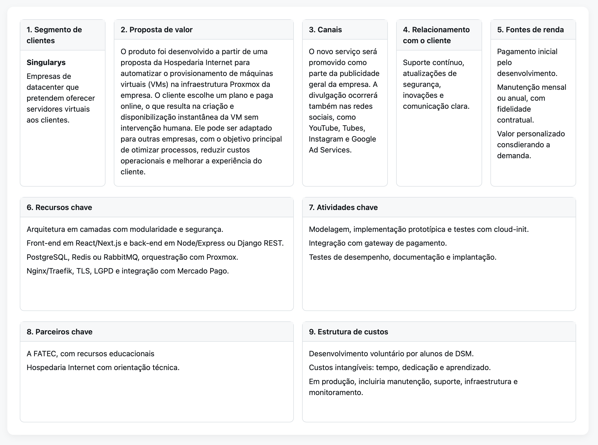
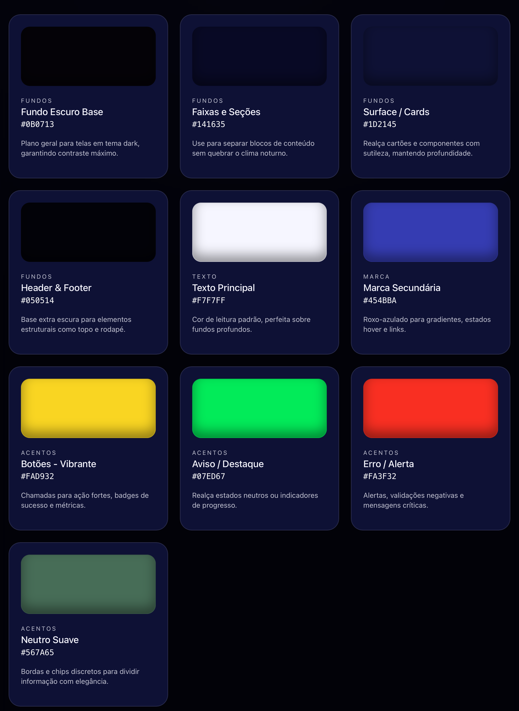

# Documentação do PI
Última atualização: 02/06/2026

# FATEC JAHU

**Faculdade de Tecnologia de Jahu**

**Curso:** Desenvolvimento de Software Multiplataforma  
**Disciplina:** Engenharia de Software II  
**Turma:** 2025.2

## Projeto

**Singularys — Portal de Contratação e Gestão de VPS**<br>
**Versão 2.0 – 2025.2 / 2026.1**<br>
**Última atualização: 02/06/2026 — Consolidação da documentação acadêmica com a documentação de engenharia**

### Integrantes

- Evellyn Santana Marinho
- José Augusto Zen Ferri
- Rafael Henrique Biliasi
- Tainara Santos

<br>

## Sumário

- [Resumo](#resumo)
- [1. Introdução](#1-introdução)
  - [1.1 Problema de Pesquisa](#11-problema-de-pesquisa)
  - [1.2 Objetivos](#12-objetivos)
    - [1.2.1 Objetivo Geral](#121-objetivo-geral)
    - [1.2.2 Objetivos Específicos](#122-objetivos-específicos)
  - [1.3 Justificativa](#13-justificativa)
- [2. Referencial Teórico](#2-referencial-teórico)
  - [2.1 Computação em Nuvem e IaaS](#21-computação-em-nuvem-e-iaas)
  - [2.2 Virtualização, Proxmox VE e KVM](#22-virtualização-proxmox-ve-e-kvm)
  - [2.3 Cloud-init e Provisionamento](#23-cloud-init-e-provisionamento)
  - [2.4 Arquitetura MVC](#24-arquitetura-mvc)
  - [2.5 Segurança, RBAC e LGPD](#25-segurança-rbac-e-lgpd)
- [3. Metodologia](#3-metodologia)
- [4. Requisitos Funcionais e Não Funcionais](#4-requisitos-funcionais-e-não-funcionais)
  - [4.1 Requisitos Funcionais](#41-requisitos-funcionais)
  - [4.2 Requisitos Não Funcionais](#42-requisitos-não-funcionais)
- [5. Estudo de Viabilidade](#5-estudo-de-viabilidade)
  - [5.1 Viabilidade Técnica](#51-viabilidade-técnica)
  - [5.2 Viabilidade Operacional](#52-viabilidade-operacional)
  - [5.3 Viabilidade Financeira](#53-viabilidade-financeira)
  - [5.4 Viabilidade de Mercado](#54-viabilidade-de-mercado)
- [6. Canvas de Modelo de Negócio](#6-canvas-de-modelo-de-negócio)
- [7. Paleta de Cores, Protótipo e Design System](#7-paleta-de-cores-protótipo-e-design-system)
- [8. Fluxo de Contratação e Provisionamento](#8-fluxo-de-contratação-e-provisionamento)
  - [8.1 Fluxo Geral de Compra](#81-fluxo-geral-de-compra)
  - [8.2 Fluxo Operacional da VPS](#82-fluxo-operacional-da-vps)
- [9. Protótipo de Arquitetura Técnica](#9-protótipo-de-arquitetura-técnica)
  - [9.1 Stack Tecnológica](#91-stack-tecnológica)
  - [9.2 Estrutura de Pastas](#92-estrutura-de-pastas)
  - [9.3 Camadas da Aplicação](#93-camadas-da-aplicação)
  - [9.4 Modelo de Dados (DER)](#94-modelo-de-dados-der)
  - [9.5 Diagrama de Classes](#95-diagrama-de-classes)
- [10. Funcionalidades Implementadas](#10-funcionalidades-implementadas)
  - [10.1 Sprint 1 — Cadastro, Portal e Identidade Visual](#101-sprint-1--cadastro-portal-e-identidade-visual)
  - [10.2 Sprint 2 — Máquinas Virtuais VPS](#102-sprint-2--máquinas-virtuais-vps)
  - [10.3 Funcionalidades Planejadas](#103-funcionalidades-planejadas)
- [11. Segurança e Governança](#11-segurança-e-governança)
- [12. Evolução da Implementação](#12-evolução-da-implementação)
- [13. Convenções do Projeto](#13-convenções-do-projeto)
- [14. Cronograma da Primeira Etapa](#14-cronograma-da-primeira-etapa)
- [15. Referências](#15-referências)

---

## Resumo

O presente projeto tem como finalidade o desenvolvimento do **Singularys**, um portal web para contratação, configuração e gestão de servidores virtuais privados, também conhecidos como VPS (*Virtual Private Servers*). A proposta inicial do projeto nasceu da necessidade de modernizar o processo de contratação e entrega de máquinas virtuais, tradicionalmente dependente de atendimento manual, validações internas e configuração técnica realizada diretamente por operadores de infraestrutura.

A versão atual do sistema evoluiu para uma plataforma acadêmica de caráter funcional, estruturada em **PHP 8**, com arquitetura **MVC**, banco de dados **MariaDB**, camada de persistência com **PDO**, interface responsiva construída com **Bootstrap 5** e identidade visual baseada em **Design Tokens**. O sistema contempla cadastro inicial simplificado, verificação de e-mail, cadastro completo de pessoa física ou jurídica, catálogo de planos VPS, carrinho, checkout com pagamento simulado, painel administrativo, controle de papéis e permissões, dashboard de máquinas virtuais e fluxo de configuração de VPS.

Do ponto de vista técnico, o Singularys foi modelado para preparar a futura integração com ambiente **Proxmox VE**, utilizando conceitos de virtualização, provisionamento e automação com **cloud-init**. No estágio atual, o provisionamento é simulado de forma controlada, preservando a lógica de negócio e a rastreabilidade dos eventos, o que permite validar o fluxo principal do sistema dentro das limitações de prazo, escopo e ambiente acadêmico.

Assim, o projeto atende ao propósito de demonstrar, de forma prática e documentada, a aplicação de conceitos de Engenharia de Software, modelagem de dados, arquitetura em camadas, desenvolvimento web, controle de acesso, responsividade e preparação para integração com infraestrutura virtualizada.

---

## 1. Introdução

O crescimento dos serviços digitais impulsionou a demanda por infraestrutura flexível, escalável e de rápida contratação. Empresas, desenvolvedores, estudantes e pequenos negócios frequentemente necessitam de servidores virtuais para hospedar aplicações, bancos de dados, sistemas internos, ambientes de testes, APIs e serviços web. Nesse contexto, os servidores virtuais privados, ou VPS, representam uma solução intermediária entre hospedagens compartilhadas e servidores dedicados, oferecendo maior autonomia, isolamento e controle técnico.

Apesar da maturidade do mercado de computação em nuvem, muitos provedores de menor porte ainda realizam parte significativa do processo de contratação e entrega de VPS de forma manual. O cliente entra em contato com a empresa, escolhe um plano, aguarda instruções de pagamento, depende da confirmação administrativa e somente depois recebe os dados de acesso ao servidor. Esse modelo limita a escalabilidade do negócio, aumenta o tempo de atendimento e reduz a experiência de autonomia esperada em serviços digitais modernos.

O projeto Singularys foi concebido para enfrentar esse problema por meio de uma plataforma web que centraliza o ciclo de contratação e gestão de VPS. A proposta permite que o cliente crie uma conta, verifique seu e-mail, complete seus dados cadastrais, escolha um plano, realize o checkout, acompanhe seus pedidos e configure a máquina virtual contratada. Em paralelo, o sistema oferece uma área administrativa para controle de usuários, contas, planos, pedidos, pagamentos e máquinas virtuais.

Embora a concepção inicial previsse o provisionamento totalmente automático das VMs logo após o pagamento, a implementação acadêmica foi ajustada para uma estratégia incremental. A versão atual prioriza a construção de uma base sólida de identidade, cadastro, fluxo comercial, painel administrativo e configuração operacional da VPS, mantendo a integração real com o Proxmox como evolução natural do projeto. Essa escolha preserva a coerência técnica e torna o produto mais aderente ao cronograma acadêmico, sem abandonar o objetivo maior de automação.

### 1.1 Problema de Pesquisa

A problemática enfrentada pelo projeto consiste na ausência de uma plataforma integrada que permita ao cliente contratar e configurar uma VPS de forma autônoma, ao mesmo tempo em que forneça ao provedor uma estrutura organizada para gerenciar contas, pedidos, pagamentos, planos e máquinas virtuais.

Diante disso, formula-se o seguinte problema de pesquisa:

**Como desenvolver um portal web, com arquitetura organizada e banco de dados relacional, capaz de centralizar o processo de contratação, configuração e gestão de VPS, preparando o sistema para futura integração com ambiente Proxmox e automação de provisionamento?**

A resposta a esse problema exige não apenas a criação de telas ou formulários, mas a definição de uma arquitetura coerente, separação adequada de responsabilidades, modelagem de dados consistente, controle de acesso, tratamento seguro de credenciais, fluxo comercial rastreável e estrutura operacional compatível com o ciclo de vida de máquinas virtuais.

### 1.2 Objetivos

#### 1.2.1 Objetivo Geral

Desenvolver o **Singularys**, um portal web para contratação, configuração e gestão de servidores VPS, utilizando arquitetura MVC, banco de dados MariaDB e interface responsiva, com preparação técnica para futura integração ao ambiente Proxmox VE.

#### 1.2.2 Objetivos Específicos

- Implementar cadastro inicial de usuários por e-mail e senha;
- Permitir verificação de e-mail por código de seis dígitos;
- Permitir cadastro completo de pessoa física e pessoa jurídica;
- Controlar unicidade de e-mail, CPF e CNPJ;
- Implementar autenticação e sessão de usuário;
- Permitir vínculo entre usuários e contas;
- Implementar controle de acesso baseado em papéis e permissões;
- Disponibilizar catálogo de planos VPS;
- Implementar carrinho e fluxo de checkout;
- Registrar pedidos e pagamentos;
- Criar máquina virtual em estado inicial de aguardando configuração;
- Permitir ao cliente configurar sistema operacional, hostname e usuário SSH;
- Registrar eventos de provisionamento;
- Disponibilizar dashboard do cliente;
- Disponibilizar painel administrativo;
- Organizar o projeto em arquitetura MVC;
- Utilizar PDO e *prepared statements* para acesso seguro ao banco de dados;
- Preparar o domínio operacional para integração futura com Proxmox VE e cloud-init.

### 1.3 Justificativa

A proposta justifica-se pela necessidade de modernização do processo de contratação e entrega de infraestrutura virtualizada. Em um ambiente de mercado cada vez mais orientado à automação, sistemas capazes de oferecer autonomia ao cliente e rastreabilidade ao provedor tornam-se diferenciais competitivos relevantes.

Do ponto de vista acadêmico, o projeto permite aplicar, em um caso prático, conceitos centrais da Engenharia de Software, como levantamento de requisitos, modelagem de dados, arquitetura em camadas, separação de responsabilidades, desenvolvimento orientado a domínio, validação de fluxos, segurança de aplicação web e documentação técnica. O sistema também dialoga com temas atuais da computação, como computação em nuvem, virtualização, provisionamento de infraestrutura, automação e controle de acesso.

A escolha por PHP, MariaDB e Bootstrap também possui justificativa pedagógica e operacional. Essas tecnologias permitem implementação objetiva, são amplamente documentadas, possuem boa compatibilidade com ambientes de hospedagem tradicionais e favorecem a entrega de um protótipo funcional dentro do prazo acadêmico. Ao mesmo tempo, a adoção do padrão MVC e de práticas como PDO, *prepared statements*, *soft delete*, versionamento de schema e design system demonstra preocupação com qualidade, manutenção e evolução do software.

---

## 2. Referencial Teórico

A fundamentação teórica do Singularys envolve diferentes áreas da computação aplicada. O projeto une conceitos de computação em nuvem, virtualização, provisionamento, arquitetura de software, segurança da informação, banco de dados relacional e desenvolvimento web. Esses elementos são necessários para compreender tanto o problema enfrentado quanto as escolhas técnicas realizadas durante a implementação.

### 2.1 Computação em Nuvem e IaaS

A computação em nuvem representa um modelo de disponibilização de recursos computacionais sob demanda, permitindo que servidores, redes, armazenamento e aplicações sejam acessados por meio da internet. O National Institute of Standards and Technology (NIST) define computação em nuvem como um modelo que possibilita acesso ubíquo, conveniente e sob demanda a um conjunto compartilhado de recursos computacionais configuráveis, que podem ser rapidamente provisionados e liberados com mínimo esforço de gerenciamento ou interação com o provedor de serviços.

Entre os modelos de serviço da computação em nuvem, destaca-se o **IaaS — Infrastructure as a Service**, no qual o cliente contrata infraestrutura virtualizada, como servidores, discos, redes e endereços IP. A VPS se enquadra nesse contexto por oferecer ao usuário um ambiente computacional isolado, com sistema operacional próprio e recursos definidos conforme o plano contratado.

O Singularys foi projetado dentro dessa lógica: o cliente não contrata apenas uma hospedagem estática, mas uma unidade de infraestrutura virtual que pode ser configurada, acompanhada e futuramente controlada pelo painel.

### 2.2 Virtualização, Proxmox VE e KVM

A virtualização permite executar múltiplas máquinas virtuais sobre o mesmo hardware físico, isolando sistemas operacionais e recursos computacionais. Essa tecnologia otimiza o uso de servidores, reduz custos e facilita a criação de ambientes independentes.

O **Proxmox VE** é uma plataforma de virtualização de código aberto que permite gerenciar máquinas virtuais, containers, redes, armazenamento, snapshots, clusters e recursos de alta disponibilidade. Ele utiliza tecnologias consolidadas, como **KVM** para virtualização completa e LXC para containers.

O **KVM — Kernel-based Virtual Machine** é uma tecnologia integrada ao kernel Linux que transforma o sistema operacional em um hipervisor. Com isso, o Linux passa a ser capaz de executar máquinas virtuais com isolamento de hardware, aproveitando recursos de virtualização presentes nos processadores modernos. A escolha do Proxmox como base conceitual do projeto decorre de sua robustez, ampla documentação, suporte a API e aderência a ambientes reais de provedores de infraestrutura.

### 2.3 Cloud-init e Provisionamento

O **cloud-init** é uma ferramenta utilizada para inicialização e configuração automática de instâncias em ambientes virtualizados ou de nuvem. Por meio dele, é possível definir hostname, usuário inicial, chaves SSH, rede, pacotes, scripts de inicialização e outras configurações da máquina virtual.

No contexto do Singularys, o cloud-init aparece como componente planejado para a automação do provisionamento das VPS. A ideia é que, após a contratação e configuração realizada pelo cliente, o sistema envie ao Proxmox os parâmetros necessários para criação de uma VM a partir de template previamente preparado.

Embora a versão atual simule o provisionamento, a modelagem do banco e o fluxo operacional já foram estruturados para suportar essa evolução. O sistema registra estado da máquina, sabor Linux, hostname, usuário SSH, data center e eventos de provisionamento, permitindo futura substituição da simulação por chamadas reais à API do Proxmox.

### 2.4 Arquitetura MVC

O padrão **MVC — Model, View, Controller** organiza a aplicação em três responsabilidades principais. O Model representa dados e regras de negócio, a View representa a camada de apresentação e o Controller atua como intermediário entre a entrada do usuário, a lógica do sistema e a resposta apresentada.

No Singularys, essa arquitetura foi adotada para melhorar a organização do código e separar responsabilidades. Os Controllers recebem as requisições e coordenam os fluxos; os DAOs realizam acesso ao banco de dados; os Models representam entidades de domínio; as Views apresentam as telas; e a camada Core concentra recursos estruturais, como roteador, conexão e helpers.

Essa separação facilita manutenção, testes, expansão e compreensão do projeto por novos desenvolvedores.

### 2.5 Segurança, RBAC e LGPD

Sistemas que tratam dados cadastrais, autenticação e infraestrutura exigem atenção especial à segurança. O Singularys adota medidas como armazenamento de senhas por hash, uso de PDO com *prepared statements*, controle de sessão, validação de dados, restrição de rotas por whitelist e controle de acesso baseado em papéis.

O **RBAC — Role-Based Access Control** é um modelo de controle de acesso no qual permissões são atribuídas a papéis, e usuários recebem papéis conforme sua função no sistema. Essa abordagem evita que permissões sejam atribuídas diretamente de forma desorganizada e permite separar perfis como administrador, titular de conta e operador.

Além disso, o projeto considera princípios de proteção de dados pessoais compatíveis com a LGPD, como minimização, controle de acesso, rastreabilidade e preservação de histórico por meio de *soft delete* quando aplicável.

---

## 3. Metodologia

A metodologia adotada foi aplicada, exploratória e incremental. O projeto partiu de uma proposta conceitual de automação do provisionamento de VPS e evoluiu para uma aplicação web funcional, com implementação progressiva dos domínios essenciais do sistema.

A primeira etapa consistiu no levantamento dos requisitos e compreensão do problema. Foram identificados os atores principais, os fluxos de contratação, as informações cadastrais necessárias, as regras de vínculo entre usuários e contas, os requisitos de segurança e os elementos mínimos para representar uma máquina virtual no sistema.

Na segunda etapa, foi realizada a modelagem do banco de dados. O modelo evoluiu para uma estrutura organizada em três domínios: Administrativo, Comercial e Operacional. Essa separação permitiu tratar identidade e acesso, contratação e pagamento, bem como máquinas virtuais e eventos técnicos de forma independente, mas integrada.

A terceira etapa envolveu a definição da arquitetura da aplicação. Optou-se pelo padrão MVC, com uso de PHP 8, MariaDB, PDO, Bootstrap 5 e JavaScript. A aplicação foi estruturada em Controllers, DAOs, Models, Views, Core e Services, permitindo maior clareza entre regras de negócio, persistência e apresentação.

A quarta etapa compreendeu a implementação dos fluxos principais: cadastro inicial, verificação de e-mail, cadastro completo PF/PJ, autenticação, catálogo de planos, carrinho, checkout, painel administrativo e dashboard de VPS. O provisionamento real foi substituído, nesta fase, por uma simulação transacional, suficiente para validar o fluxo operacional e preservar a rastreabilidade dos eventos.

A quinta etapa contemplou testes funcionais, ajustes de interface, validação da responsividade, refinamento do design system e documentação. A documentação acadêmica foi então atualizada para refletir o estado real da implementação, evitando divergência entre a proposta inicial e o sistema efetivamente desenvolvido.

---

## 4. Requisitos Funcionais e Não Funcionais

Os requisitos foram reorganizados a partir da versão efetivamente implementada do projeto. A modelagem atual prioriza o fluxo completo de entrada do usuário no sistema, contratação de plano, configuração da VPS e acompanhamento administrativo.

### 4.1 Requisitos Funcionais

| Código | Requisito | Descrição |
|---|---|---|
| <a id="rf01"></a>RF01 | Criar conta | O sistema deve permitir que um novo usuário crie conta informando e-mail e senha. |
| <a id="rf02"></a>RF02 | Verificar e-mail | O sistema deve permitir verificação de e-mail por código de seis dígitos, com validade limitada. |
| <a id="rf03"></a>RF03 | Completar cadastro | O sistema deve permitir completar cadastro como pessoa física ou pessoa jurídica. |
| <a id="rf04"></a>RF04 | Validar unicidade cadastral | O sistema deve impedir duplicidade de e-mail, CPF e CNPJ. |
| <a id="rf05"></a>RF05 | Autenticar usuário | O sistema deve permitir login por e-mail e senha, com possibilidade de contexto de conta. |
| <a id="rf06"></a>RF06 | Gerenciar telefones | O sistema deve permitir adicionar e remover telefones vinculados à conta, respeitando limite de ativos. |
| <a id="rf07"></a>RF07 | Gerenciar endereços | O sistema deve permitir adicionar, remover e definir endereços vinculados à conta. |
| <a id="rf08"></a>RF08 | Listar planos VPS | O sistema deve exibir catálogo de planos disponíveis para contratação. |
| <a id="rf09"></a>RF09 | Adicionar plano ao carrinho | O sistema deve permitir que o cliente selecione um plano e o mantenha em carrinho de sessão. |
| <a id="rf10"></a>RF10 | Realizar checkout | O sistema deve permitir finalização da contratação com pagamento simulado. |
| <a id="rf11"></a>RF11 | Registrar pedido | O sistema deve registrar pedido associado à conta, ao plano e ao valor contratado. |
| <a id="rf12"></a>RF12 | Registrar pagamento | O sistema deve registrar o pagamento associado ao pedido. |
| <a id="rf13"></a>RF13 | Criar VM inicial | Após o pagamento, o sistema deve criar uma máquina virtual em estado aguardando configuração. |
| <a id="rf14"></a>RF14 | Configurar VPS | O sistema deve permitir escolher sistema operacional, hostname e usuário SSH. |
| <a id="rf15"></a>RF15 | Concluir configuração | O sistema deve permitir concluir a configuração e simular o provisionamento da máquina. |
| <a id="rf16"></a>RF16 | Exibir dashboard de VPS | O sistema deve apresentar as máquinas virtuais contratadas e seu estado atual. |
| <a id="rf17"></a>RF17 | Exibir painel administrativo | O sistema deve permitir administração de contas, usuários, planos, pedidos e pagamentos. |
| <a id="rf18"></a>RF18 | Controlar permissões | O sistema deve controlar acesso por papéis e permissões. |
| <a id="rf19"></a>RF19 | Registrar eventos de provisionamento | O sistema deve registrar eventos técnicos associados ao ciclo de vida da VM. |
| <a id="rf20"></a>RF20 | Recuperar senha | O sistema deve possuir estrutura preparada para recuperação de senha. |

### 4.2 Requisitos Não Funcionais

| Código | Categoria | Descrição |
|---|---|---|
| <a id="rnf01"></a>RNF01 | Arquitetura | O sistema deve utilizar padrão MVC para separação de responsabilidades. |
| <a id="rnf02"></a>RNF02 | Segurança | O sistema deve armazenar senhas utilizando hash seguro. |
| <a id="rnf03"></a>RNF03 | Segurança | O acesso ao banco deve utilizar PDO e *prepared statements*. |
| <a id="rnf04"></a>RNF04 | Segurança | O sistema deve utilizar controle de acesso baseado em papéis. |
| <a id="rnf05"></a>RNF05 | Integridade | O banco deve preservar integridade referencial por chaves primárias, estrangeiras e únicas. |
| <a id="rnf06"></a>RNF06 | Integridade | Exclusões críticas devem ser tratadas por *soft delete* ou revogação lógica. |
| <a id="rnf07"></a>RNF07 | Usabilidade | A interface deve ser responsiva e compatível com desktop, tablet e mobile. |
| <a id="rnf08"></a>RNF08 | Usabilidade | O sistema deve utilizar máscaras e validações para melhorar a entrada de dados. |
| <a id="rnf09"></a>RNF09 | Manutenibilidade | O schema do banco deve ser versionado e nunca sobrescrito sem controle. |
| <a id="rnf10"></a>RNF10 | Auditabilidade | O sistema deve manter registros de criação, alteração e eventos operacionais. |
| <a id="rnf11"></a>RNF11 | Portabilidade | A aplicação deve funcionar em ambiente PHP 8 e MariaDB. |
| <a id="rnf12"></a>RNF12 | Evolutividade | A modelagem deve permitir futura integração com API do Proxmox. |
| <a id="rnf13"></a>RNF13 | Segurança Operacional | Credenciais sensíveis de VM não devem ser persistidas de forma insegura. |
| <a id="rnf14"></a>RNF14 | Padronização Visual | A identidade visual deve ser centralizada por Design Tokens. |

---

## 5. Estudo de Viabilidade

A implementação do Singularys foi analisada sob quatro perspectivas principais: técnica, operacional, financeira e de mercado. Essa análise permite demonstrar que o projeto é viável tanto como atividade acadêmica quanto como base para evolução futura em ambiente real.

### 5.1 Viabilidade Técnica

A solução demonstra viabilidade técnica porque utiliza tecnologias consolidadas, documentadas e compatíveis com ambientes de hospedagem tradicionais. O uso de **PHP 8** permite desenvolvimento web com baixa complexidade de implantação. O **MariaDB** oferece persistência relacional robusta e adequada à modelagem do sistema. O **PDO** fornece uma camada segura de acesso ao banco de dados, enquanto o **Bootstrap 5** permite construção de interface responsiva com agilidade.

A escolha do padrão **MVC** reforça a manutenibilidade da aplicação, separando responsabilidades entre controle, apresentação, persistência e domínio. A estrutura também é compatível com evolução futura para serviços externos, como integração com gateway de pagamento real, API do Proxmox e assistente de IA.

A infraestrutura planejada com **Proxmox VE** e **cloud-init** também é tecnicamente viável. O Proxmox fornece API para criação e gerenciamento de VMs, enquanto o cloud-init permite parametrizar instâncias a partir de templates. Embora o provisionamento real ainda não esteja automatizado nesta versão acadêmica, o domínio operacional foi modelado para suportar essa etapa.

### 5.2 Viabilidade Operacional

Do ponto de vista operacional, o Singularys reduz a dependência de controles manuais e distribui responsabilidades entre o cliente e a administração. O cliente passa a realizar cadastro, contratação e configuração inicial da VPS pelo próprio portal. A administração, por sua vez, conta com painel para consulta e gerenciamento de contas, planos, pedidos e pagamentos.

A estrutura em dashboards facilita o acompanhamento das máquinas virtuais e permite que o estado da VPS seja comunicado de forma clara ao usuário. Estados como "Aguardando Configuração", "Ligada" e "Desligada" contribuem para transparência operacional.

A adoção de eventos de provisionamento também favorece diagnóstico e auditoria, pois permite registrar cada etapa relevante do ciclo de vida da máquina virtual.

### 5.3 Viabilidade Financeira

O projeto é financeiramente viável porque utiliza tecnologias livres ou de baixo custo. PHP, MariaDB, Bootstrap, Proxmox VE e cloud-init podem ser utilizados sem custos diretos de licenciamento no contexto proposto. Além disso, o desenvolvimento acadêmico reduz custos de implantação inicial.

Em cenário real, a plataforma poderia reduzir tempo de atendimento, diminuir retrabalho administrativo e ampliar a capacidade de venda de VPS sem crescimento proporcional da equipe técnica. O modelo também permite expansão futura para planos recorrentes, upgrades, renovações automáticas e integração com gateways de pagamento.

### 5.4 Viabilidade de Mercado

Existe demanda consistente por VPS entre desenvolvedores, pequenas empresas, estudantes, agências, profissionais autônomos e negócios que necessitam hospedar aplicações, APIs, bancos de dados ou ambientes de teste. A possibilidade de contratar e configurar uma VPS por portal próprio aumenta a competitividade de provedores de menor porte.

O Singularys apresenta potencial de mercado por unir simplicidade de contratação, gestão centralizada e preparação para automação. Ainda que a versão atual seja acadêmica, o projeto demonstra um caminho realista para modernização de provedores que já possuem infraestrutura virtualizada, mas ainda dependem de processos comerciais e operacionais manuais.

---

## 6. Canvas de Modelo de Negócio

O modelo de negócio foi estruturado com base na metodologia **Business Model Canvas**, desenvolvida por Osterwalder e Pigneur. O Canvas permite representar, em uma única visão, os principais elementos do empreendimento, como proposta de valor, segmentos de clientes, canais, relacionamento, fontes de receita, recursos-chave, atividades-chave, parcerias e estrutura de custos.

No contexto do Singularys, a proposta de valor está relacionada à oferta de contratação simplificada de VPS, com autonomia para o cliente e gestão centralizada para o provedor. O público-alvo inclui desenvolvedores, estudantes, pequenas empresas, profissionais de tecnologia, agências digitais e organizações que precisam de servidores virtuais com baixo atrito de contratação.

A imagem do Canvas deve permanecer vinculada ao arquivo original do projeto:



---

## 7. Paleta de Cores, Protótipo e Design System

A identidade visual do projeto foi consolidada em um **Design System** baseado em tokens. Essa abordagem permite centralizar cores, espaçamentos, bordas, sombras e demais elementos visuais em arquivos reutilizáveis, reduzindo inconsistências entre as telas.

O front-end utiliza **Bootstrap 5** como base de responsividade e componentes, complementado por CSS próprio. O arquivo `tokens.css` concentra variáveis de marca, enquanto `app.css` aplica os estilos específicos do portal, como cards, formulários, botões, layout da área logada, elementos de dashboard e componentes visuais reutilizáveis.

A paleta original do projeto deve permanecer referenciada pelo arquivo:



O protótipo visual desenvolvido no Figma permanece como artefato de apoio à concepção da interface:

https://www.figma.com/proto/Pw26SgXljrD4fwjItDOrJI/Prot%C3%B3tipo-singularys?node-id=2053-101&t=Cx1jDxWT21nUT1KS-1

---

## 8. Fluxo de Contratação e Provisionamento

O fluxo de contratação do Singularys foi ajustado para refletir a experiência real implementada no sistema. A lógica atual prioriza entrada simplificada do usuário, validação progressiva de cadastro e criação da VPS em estado inicial após o pagamento.

### 8.1 Fluxo Geral de Compra

1. O visitante acessa a landing page do Singularys;
2. O usuário consulta o catálogo de planos VPS;
3. O usuário seleciona um plano;
4. Caso não esteja autenticado, realiza cadastro ou login;
5. Após criar conta, acessa a dashboard mesmo com cadastro incompleto;
6. O sistema solicita verificação de e-mail por código de seis dígitos;
7. Para contratar, o usuário deve completar o cadastro como PF ou PJ;
8. O plano é adicionado ao carrinho;
9. O usuário prossegue para o checkout;
10. O pagamento é simulado;
11. O sistema registra pedido e pagamento;
12. O sistema cria uma VPS em estado "Aguardando Configuração";
13. A VPS aparece no dashboard do cliente.

### 8.2 Fluxo Operacional da VPS

1. O cliente acessa a área "VPS" no menu lateral;
2. O sistema exibe os detalhes da máquina virtual e do plano contratado;
3. Enquanto a VM estiver em estado "Aguardando Configuração", o cliente pode informar:
   - Sistema operacional;
   - Hostname;
   - Usuário SSH;
   - Data center, quando aplicável ao fluxo;
4. O cliente conclui a configuração;
5. O sistema registra a solicitação de provisionamento;
6. Na versão atual, o sistema simula o provisionamento em transação;
7. A VM passa para o estado "Ligada" ou "Ativa";
8. O sistema gera IPv4 simulado e aplica as especificações do plano;
9. O sistema registra evento de sucesso no histórico de provisionamento.

Esse fluxo permite validar o comportamento completo da aplicação sem depender, nesta fase, de chamadas reais ao Proxmox. A estrutura, entretanto, já está preparada para substituir a simulação por integração efetiva com API de infraestrutura.

---

## 9. Protótipo de Arquitetura Técnica

A arquitetura técnica do Singularys foi desenhada para equilibrar simplicidade acadêmica, clareza didática e potencial de evolução. A solução evita complexidade excessiva, mas aplica princípios importantes de organização de software, como separação de responsabilidades, persistência estruturada e modularidade.

### 9.1 Stack Tecnológica

| Camada | Tecnologia | Finalidade |
|---|---|---|
| Linguagem | PHP 8 | Implementação do back-end e regras de negócio |
| Arquitetura | MVC | Separação entre controle, domínio, persistência e apresentação |
| Banco de dados | MariaDB/MySQL | Persistência relacional das entidades do sistema |
| Acesso a dados | PDO | Comunicação segura com o banco de dados |
| Front-end | Bootstrap 5 | Interface responsiva |
| Estilos | CSS com Design Tokens | Padronização visual |
| Scripts | JavaScript | Máscaras, interações e comportamentos de tela |
| Infraestrutura planejada | Proxmox VE | Gerenciamento de máquinas virtuais |
| Provisionamento planejado | cloud-init | Configuração inicial automatizada da VPS |

### 9.2 Estrutura de Pastas

```text
Portal_MVC/
├─ public/
│  ├─ index.php
│  ├─ css/
│  │  ├─ tokens.css
│  │  ├─ app.css
│  │  └─ style*.css
│  └─ js/
├─ app/
│  ├─ controllers/
│  ├─ dao/
│  ├─ models/
│  ├─ core/
│  ├─ services/
│  └─ views/
│     └─ partials/
├─ config/
│  ├─ config.php
│  ├─ database.php
│  └─ rotas.php
└─ docs/
```

A pasta `public` representa a raiz web da aplicação e concentra o `index.php`, que atua como **front controller**. As requisições passam por esse ponto de entrada e são direcionadas pelo roteador conforme a whitelist definida em `config/rotas.php`.

A pasta `app` concentra o núcleo da aplicação. Os `controllers` coordenam os fluxos; os `dao` realizam acesso ao banco de dados; os `models` representam entidades de domínio; o `core` agrupa recursos estruturais; os `services` concentram integrações; e as `views` armazenam as telas e parciais reutilizáveis.

### 9.3 Camadas da Aplicação

O fluxo geral da arquitetura pode ser representado da seguinte forma:

```text
Navegador
   ↓
public/index.php
   ↓
Roteador
   ↓
Controller
   ↓
DAO → Conexao/PDO → MariaDB
   ↓
Model / Helper / Service
   ↓
View
   ↓
Resposta ao usuário
```

Essa estrutura favorece a manutenção do projeto. Quando uma regra de negócio precisa ser alterada, ela tende a ficar concentrada no Controller, Model, DAO ou Service correspondente, sem exigir modificação indiscriminada em todas as telas. Da mesma forma, alterações visuais podem ser feitas nas Views e arquivos CSS sem comprometer a persistência dos dados.

### 9.4 Modelo de Dados (DER)

O modelo de dados do Singularys foi estruturado em três domínios principais: **Administrativo**, **Comercial** e **Operacional**. Essa organização torna a leitura do banco mais clara e facilita a evolução do sistema.

#### 9.4.1 Domínio Administrativo

O domínio administrativo concentra as entidades relacionadas à identidade, cadastro e controle de acesso. Ele responde a perguntas como: quem é o usuário, a qual conta ele pertence, qual é seu papel, quais dados cadastrais estão vinculados à conta e quais permissões ele possui.

| Tabela | Finalidade |
|---|---|
| `usuarios` | Armazena dados de login, e-mail, senha e situação do usuário |
| `tokens_verificacao_email` | Armazena códigos de verificação de e-mail |
| `tokens_reset_senha` | Armazena códigos de recuperação de senha |
| `contas` | Representa a conta-cliente, que pode ser PF ou PJ |
| `pessoas_fisicas` | Armazena dados específicos de titulares pessoa física |
| `pessoas_juridicas` | Armazena dados específicos de titulares pessoa jurídica e representante legal |
| `enderecos` | Armazena endereços deduplicados |
| `contas_enderecos` | Vincula contas a endereços, com papel e soft delete |
| `telefones` | Armazena telefones deduplicados |
| `contas_telefones` | Vincula contas a telefones, com limite de ativos e soft delete |
| `papeis` | Define papéis de acesso |
| `permissoes` | Define permissões do sistema |
| `papeis_permissoes` | Relaciona papéis e permissões |
| `usuarios_contas` | Relaciona usuários, contas e papéis |

A entidade `usuarios` não se confunde com a entidade `contas`. Um usuário representa a pessoa que acessa o sistema por login e senha. A conta representa a unidade comercial que contrata serviços. Essa separação permite que uma conta tenha mais de um usuário, como titular e operador, e que as permissões sejam controladas por vínculo.

#### 9.4.2 Domínio Comercial

O domínio comercial representa o processo de contratação. Ele contém planos, pedidos e pagamentos, permitindo registrar o caminho entre a escolha do plano e a geração da VPS.

| Tabela | Finalidade |
|---|---|
| `planos_vps` | Catálogo de planos disponíveis |
| `pedidos` | Registro da contratação realizada pela conta |
| `pagamentos` | Registro da tentativa ou confirmação de pagamento |

A tabela `planos_vps` armazena as especificações comerciais do produto, como CPU, memória, armazenamento e preço. A tabela `pedidos` registra a intenção de contratação e o valor total. A tabela `pagamentos` registra a situação financeira associada ao pedido.

#### 9.4.3 Domínio Operacional

O domínio operacional representa a camada técnica da VPS. Ele registra máquinas virtuais, sistemas operacionais disponíveis, data centers, solicitações e eventos de provisionamento.

| Tabela | Finalidade |
|---|---|
| `sabores_linux` | Catálogo de sistemas operacionais disponíveis |
| `data_centers` | Catálogo de localidades de infraestrutura |
| `maquinas_virtuais` | Representa a VPS criada a partir de um pedido pago |
| `provisionamento_solicitacoes` | Registra solicitação de provisionamento da VM |
| `eventos_provisionamento` | Registra histórico técnico da VM |

A tabela `maquinas_virtuais` é o elo entre o domínio comercial e o operacional. Ela representa a entrega técnica decorrente de um pedido pago. Inicialmente, a VM nasce em estado "Aguardando Configuração". Depois que o cliente define os parâmetros operacionais, o sistema registra a solicitação de provisionamento e atualiza o ciclo de vida da máquina.

#### 9.4.4 Diagrama ER


### 9.5 Diagrama de Classes

O diagrama de classes representa a visão orientada a objetos do Singularys. Diferentemente do DER, que descreve tabelas, chaves e relacionamentos de banco de dados, o diagrama de classes apresenta os principais objetos da aplicação, seus atributos, métodos e dependências.

Na versão atual do projeto, a modelagem de classes precisa refletir não apenas as entidades de domínio, mas também a arquitetura MVC utilizada na implementação. Por isso, o diagrama combina classes de controle, persistência, domínio e serviços. Essa abordagem é adequada ao estágio acadêmico do projeto porque permite visualizar como a requisição percorre a aplicação.

#### 9.5.1 Diagrama de Classes


#### 9.5.2 Explicação do Diagrama de Classes

### Leitura do Diagrama de Classes

A leitura do diagrama começa pela classe `Usuario`, que representa a pessoa que acessa o sistema. Essa classe concentra informações essenciais de identificação e autenticação, como nome, e-mail, senha protegida por hash, telefone, situação de ativação e datas de criação e atualização. Seus métodos indicam comportamentos gerais esperados no sistema, como realizar login, encerrar sessão, realizar pedido e iniciar uma conversa com a assistente virtual. Dessa forma, o usuário aparece como ponto de partida das principais interações do portal.

O controle de permissões é representado pelas classes `Papel` e `UsuarioPapel`. A classe `Papel` define os perfis de acesso existentes no sistema, enquanto `UsuarioPapel` funciona como classe associativa entre usuários e papéis. Essa estrutura permite que um mesmo usuário possua diferentes níveis de permissão, conforme sua função dentro da plataforma. A relação entre essas classes demonstra a adoção de um modelo flexível de controle de acesso, adequado para diferenciar clientes, operadores e administradores.

A classe `Plano` representa os produtos oferecidos pela plataforma, isto é, os planos de VPS disponíveis para contratação. Ela reúne informações como nome, quantidade de CPU, memória RAM, armazenamento, preço e situação de ativação. Seus métodos indicam operações administrativas básicas, como ativar, desativar e alterar o preço de um plano. Essa classe se relaciona diretamente com `Pedido`, pois cada contratação realizada pelo usuário deve estar vinculada a um plano previamente cadastrado.

A classe `Pedido` representa a solicitação de contratação feita pelo usuário. Ela armazena o status do pedido, o valor da contratação e as datas de criação e atualização. Seus métodos indicam comportamentos como criar pedido, cancelar pedido e atualizar status. O relacionamento entre `Usuario` e `Pedido` demonstra que um usuário pode realizar várias contratações ao longo do tempo. Já o relacionamento entre `Plano` e `Pedido` indica que cada pedido está associado a um plano contratado.

A classe `Pagamento` representa a etapa financeira do processo. Ela contém dados como meio de pagamento, status, identificação da transação no gateway, chave de idempotência, valor e data de confirmação. A presença da chave de idempotência é relevante porque demonstra preocupação com segurança e confiabilidade no processamento financeiro, evitando que uma mesma transação seja processada mais de uma vez em caso de repetição de eventos ou falhas de comunicação. O relacionamento entre `Pedido` e `Pagamento` indica que cada pedido gera um pagamento correspondente.

Após a contratação e confirmação do pagamento, o sistema passa ao domínio operacional, representado principalmente pela classe `MaquinaVirtual`. Essa classe reúne os dados técnicos da VPS, como identificador no ambiente de virtualização, nó do servidor, hostname, endereço IP, status, quantidade de CPU, memória, disco e modelo utilizado para criação. Seus métodos representam ações do ciclo de vida da máquina virtual, como ligar, desligar, reiniciar e provisionar. Assim, a classe `MaquinaVirtual` sintetiza a entrega técnica do serviço contratado pelo cliente.

A classe `Credencial` representa os dados de acesso associados à máquina virtual. Ela possui informações como usuário da VM, senha protegida por hash, tipo de hash utilizado e data de criação. Seus métodos indicam comportamentos como gerar credenciais e alterar senha. O relacionamento entre `MaquinaVirtual` e `Credencial` demonstra que uma máquina pode possuir credenciais associadas para permitir o acesso controlado ao ambiente provisionado.

A classe `EventoProvisionamento` registra os acontecimentos técnicos relacionados ao processo de criação e configuração da máquina virtual. Ela contém tipo, status, mensagem e data de criação do evento. Essa estrutura é importante para rastreabilidade, auditoria e diagnóstico de falhas, pois permite acompanhar as etapas executadas durante o provisionamento. O relacionamento entre `Pedido` e `EventoProvisionamento` indica que os eventos técnicos podem ser acompanhados a partir da contratação que originou o processo.

A classe `LogAuditoria` representa o registro das ações relevantes realizadas dentro do sistema. Ela armazena a ação executada, sua descrição, endereço IP, agente de usuário e data de criação. O relacionamento com `Usuario` demonstra que as operações importantes podem ser vinculadas ao usuário responsável, contribuindo para segurança, governança e controle administrativo da aplicação.

A classe `FilaTarefa` representa o processamento assíncrono de tarefas. Ela contém informações como tipo da tarefa, dados em formato JSON, status, número de tentativas, eventual erro e data de criação. Seus métodos indicam a possibilidade de adicionar tarefas à fila, executá-las e reprocessá-las em caso de falha. Conceitualmente, essa classe é relevante porque certas operações, como provisionamento de máquinas virtuais ou integrações externas, podem ser demoradas e não devem bloquear a navegação do usuário no portal.

O diagrama também contempla o módulo de interação com a assistente virtual, a ser implementado no sprint 3, representado pelas classes `Conversa`, `Mensagem` e `FeedbackIA`. A classe `Conversa` representa uma sessão de atendimento iniciada pelo usuário. A classe `Mensagem` registra as mensagens trocadas durante essa conversa, indicando remetente, conteúdo e data de criação. A classe `FeedbackIA`, por sua vez, permite registrar uma avaliação da interação, com nota e comentário. Esse conjunto demonstra a possibilidade de evolução do sistema para incorporar atendimento inteligente e coleta de feedback dos usuários.

Por fim, a classe `Token` representa códigos ou identificadores temporários utilizados em fluxos de segurança, como verificação de e-mail, recuperação de senha ou validação de ações específicas. Ela possui token protegido por hash, data de expiração e data de criação, além de métodos para gerar, validar e revogar tokens. O relacionamento entre `Usuario` e `Token` indica que cada usuário pode possuir múltiplos tokens ao longo do tempo, conforme as operações de segurança realizadas.

Em síntese, o diagrama demonstra que o Singularys foi modelado a partir de três grandes domínios. O primeiro é o domínio administrativo, composto por usuários, papéis, tokens e logs de auditoria. O segundo é o domínio comercial, formado por planos, pedidos e pagamentos. O terceiro é o domínio operacional, composto por máquinas virtuais, credenciais, eventos de provisionamento e tarefas assíncronas. Além disso, o modelo prevê um domínio complementar de interação inteligente, representado pelas conversas, mensagens e feedbacks da assistente virtual.

Essa organização permite compreender o funcionamento geral do sistema sem expor detalhes sensíveis da implementação. O usuário acessa o portal, possui permissões, escolhe um plano, realiza um pedido, efetua o pagamento e, a partir disso, o sistema registra a máquina virtual e os eventos de provisionamento. Paralelamente, logs, tokens e filas de tarefas oferecem suporte à segurança, auditoria e confiabilidade da aplicação. Portanto, o diagrama cumpre o papel de representar a arquitetura conceitual do Singularys de forma clara, segura e adequada ao contexto acadêmico.

---

## 10. Funcionalidades Implementadas

A implementação foi organizada em sprints, permitindo evolução progressiva e validação parcial das funcionalidades.

### 10.1 Sprint 1 — Cadastro, Portal e Identidade Visual

A primeira sprint concentrou-se na criação da base funcional do sistema. Foram implementados o cadastro inicial por e-mail e senha, o login, a verificação de e-mail por código de seis dígitos, a complementação cadastral como pessoa física ou jurídica, o gerenciamento de telefones e endereços, o catálogo de planos, o carrinho, o checkout com pagamento simulado e o painel administrativo.

Também foi realizada uma evolução significativa da interface visual. A área logada passou a utilizar layout com barra lateral, componentes padronizados, formulários organizados em seções, ícones, máscaras de entrada para CPF, CNPJ, CEP e telefone, além de design tokens para centralizar a identidade da marca.

### 10.2 Sprint 2 — Máquinas Virtuais VPS

A segunda sprint concentrou-se no domínio operacional. Foi implementado o dashboard de VPS, com exibição de máquinas virtuais contratadas e seus respectivos estados. A interface apresenta cartões com detalhes da máquina virtual e detalhes do plano contratado.

Enquanto a VM está em estado "Aguardando Configuração", o usuário pode escolher o sistema operacional, definir hostname e usuário SSH. Ao concluir a configuração, o sistema simula o provisionamento, altera o estado da máquina, gera um IPv4 público simulado, aplica as especificações do plano e registra evento de sucesso.

Também foram definidos catálogos de data centers e sabores Linux, incluindo Debian, Ubuntu Server, AlmaLinux e Rocky Linux.

### 10.3 Funcionalidades Planejadas

Entre as funcionalidades planejadas para evolução estão a integração real com a API do Proxmox, o provisionamento automatizado por cloud-init, a integração com gateway de pagamento real, melhorias no painel administrativo, criação de rotinas de renovação de faturas, snapshots, backups e a assistente de IA Ava.

A Ava foi planejada como assistente de atendimento e apoio ao usuário, integrada por proxy PHP a um servidor próprio de IA, sem exposição direta do endpoint ao navegador.

---

## 11. Segurança e Governança

O Singularys incorpora práticas de segurança compatíveis com o escopo acadêmico e com a natureza do sistema. Entre as medidas adotadas estão o uso de hash seguro para senhas, controle de acesso baseado em papéis, sessões de usuário, whitelist de rotas, PDO com *prepared statements* e escape de saída em telas.

A política de integridade do banco evita dependência de exclusões em cascata. Em vez disso, o projeto utiliza *soft delete* ou revogação lógica para preservar histórico e rastreabilidade. Essa decisão é especialmente importante em sistemas que envolvem contas, contratos, pagamentos e recursos operacionais, pois a exclusão física indiscriminada poderia prejudicar auditoria e consistência.

No domínio operacional, a documentação de engenharia destaca que credenciais sensíveis de VM, como senhas e chaves, não devem ser persistidas de forma insegura. O dashboard principal também evita expor IPv4 e usuário SSH em resumos públicos, reduzindo exposição desnecessária de informações técnicas.

As futuras integrações com Proxmox deverão utilizar tokens de API com menor privilégio possível, escopo restrito e registro de eventos. O provisionamento real deverá ocorrer somente após verificação de e-mail, cadastro completo e confirmação de pagamento.

---

## 12. Evolução da Implementação

Durante o desenvolvimento, o projeto passou por uma evolução relevante. A proposta inicial estava fortemente centrada no provisionamento automático imediato de máquinas virtuais após pagamento. Com o avanço da análise, percebeu-se que, para uma entrega acadêmica consistente, seria mais adequado construir primeiro a base completa do sistema: identidade, cadastro, contas, planos, pedidos, pagamentos, painel administrativo e estado operacional da VPS.

Essa decisão não representa abandono do objetivo original. Pelo contrário, representa maturidade de engenharia. Um provisionamento automático confiável depende de uma base comercial e administrativa bem definida. Antes de criar máquinas virtuais reais, é necessário saber quem é o cliente, qual conta realizou a contratação, qual plano foi contratado, se o pagamento foi confirmado, qual sistema operacional foi escolhido e quais parâmetros devem ser enviados à infraestrutura.

Assim, a versão atual do Singularys entrega uma fundação sólida e coerente. O provisionamento simulado permite validar o fluxo de ponta a ponta e preparar a transição para integração real com Proxmox. O projeto, portanto, evoluiu de uma ideia de automação isolada para uma plataforma completa de contratação e gestão de VPS.

---

## 13. Convenções do Projeto

O projeto adota convenções para facilitar leitura, manutenção e continuidade por outros desenvolvedores.

- Identificadores de código, nomes de arquivos e SQL devem evitar acentos;
- Textos exibidos ao usuário devem utilizar português brasileiro corretamente acentuado;
- Classes PHP devem seguir PascalCase;
- Arquivos de classe utilizam a extensão `.class.php`;
- Controllers devem concentrar coordenação de fluxo, não consultas SQL extensas;
- DAOs devem concentrar acesso ao banco de dados;
- Models devem representar entidades de domínio;
- Services devem concentrar integrações e rotinas externas;
- Schemas de banco devem ser versionados;
- Seeds de teste devem acompanhar a versão do schema;
- A identidade visual deve ser preferencialmente alterada por meio dos tokens centrais.

---

## 14. Cronograma da Primeira Etapa

| Mês | Dia | Tarefa |
|---|---:|---|
| Agosto | 25 | Formação da equipe |
| Setembro | 01 | Definição do tema e objetivo |
| Setembro | 22 | Documento de requisitos |
| Setembro | 29 | Estudo de viabilidade |
| Outubro | 13 | Modelo de negócio Canvas |
| Outubro | 20 | Planejamento do design |
| Outubro | 27 | Modelagens iniciais DER e UML |
| Novembro | 03 | Entrega do protótipo |
| Novembro | 25 | Entrega da aplicação e documentação |
| Novembro | 25 | Apresentação do PI com modelo estático|
| Maio/Junho | 2026 | Consolidação da engenharia, banco, dashboard e documentação atualizada |

---

## 15. Referências

NATIONAL INSTITUTE OF STANDARDS AND TECHNOLOGY. **The NIST Definition of Cloud Computing**. NIST Special Publication 800-145. Gaithersburg: NIST, 2011. Disponível em: https://nvlpubs.nist.gov/nistpubs/legacy/sp/nistspecialpublication800-145.pdf. Acesso em: 07 set. 2025.

PRESSMAN, Roger S.; MAXIM, Bruce R. **Engenharia de Software: uma abordagem profissional**. Porto Alegre: AMGH.

SOMMERVILLE, Ian. **Engenharia de Software**. São Paulo: Pearson.

PROXMOX SERVER SOLUTIONS. **Proxmox VE Documentation**. Disponível em: https://pve.proxmox.com/pve-docs/. Acesso em: 02 jun. 2026.

CLOUD-INIT. **Cloud-init Documentation**. Disponível em: https://cloudinit.readthedocs.io/. Acesso em: 02 jun. 2026.

OSTERWALDER, Alexander; PIGNEUR, Yves. **Business Model Generation**. Hoboken: John Wiley & Sons, 2010.

RIOS, Larissa Soares de Queiroz. **Intenção de compra no social commerce: um estudo sobre a perspectiva dos consumidores brasileiros**. 2019. Dissertação (Mestrado em Administração) – Universidade Federal de Sergipe, São Cristóvão, 2019. Disponível em: https://ri.ufs.br/bitstream/riufs/14120/2/LARISSA_SOARES_QUEIROZ_RIOS.pdf. Acesso em: 07 set. 2025.
